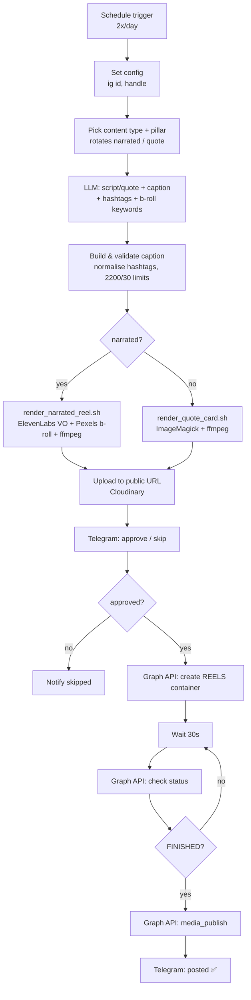

# System design

An automated pipeline that **creates** short vertical videos for a
finance / wealth / success / positive-mindset account and **publishes** them to
Instagram through the official Graph API — with a human approval step in the
middle.

Chosen configuration:

- **Publishing:** official Instagram Graph API (ToS-safe, needs a Business/
  Creator account linked to a Facebook Page).
- **Content:** two formats, rotated — faceless **narrated Reels** and motion
  **quote cards**.
- **Control:** **review before posting** (Telegram approve/skip).
- **Budget:** ~AUD 20–30/month → self-hosted n8n + local ffmpeg/ImageMagick
  rendering + free stock/hosting + ElevenLabs Starter.

## Pipeline



## Components

| Stage | Tool | Where it lives |
| --- | --- | --- |
| Orchestration | **n8n** (self-hosted) | `n8n/auto-instagram-workflow.json` |
| Idea + script + caption | LLM (OpenAI `gpt-4o-mini`) | HTTP node; prompts in `prompts/` |
| Caption / hashtag rules | ported into a Code node | canonical spec: `auto_instagram/` |
| Voiceover | **ElevenLabs** TTS | `scripts/render_narrated_reel.sh` |
| B-roll footage | **Pexels** (free) | `scripts/render_narrated_reel.sh` |
| Rendering | **ffmpeg** + **ImageMagick** | `scripts/render_*.sh` |
| Public hosting | **Cloudinary** (free) | `scripts/upload_public.sh` |
| Approval | **Telegram** (send & wait) | workflow node |
| Publishing | **Instagram Graph API** | workflow nodes |

## The two content formats

- **Narrated Reel** — LLM writes a 90–140 word script → ElevenLabs voiceover →
  3 portrait Pexels clips normalised to 1080×1920 and stitched to the voiceover
  length → optional on-screen hook for the first 3.5s → MP4.
- **Quote card** — LLM writes a short quote → ImageMagick renders auto-wrapped
  text on a branded gradient with your handle → ffmpeg adds a slow zoom → MP4.

Both print `{"video_url": "...", "duration": N}`; the workflow feeds `video_url`
straight into the Graph API.

## Publishing (Instagram Graph API)

Three calls, exactly as encoded in the workflow:

1. `POST /{ig-user-id}/media` with `media_type=REELS`, `video_url`, `caption`
   → returns a **container id**.
2. Poll `GET /{container-id}?fields=status_code` until `FINISHED` (Reels need a
   little processing time).
3. `POST /{ig-user-id}/media_publish` with `creation_id` → the Reel goes live.

Reel media requirements to keep the render within: MP4/MOV, H.264 + AAC, 9:16,
1080×1920, 30fps, ≤ 60s recommended. Publishing is rate-limited to 50 posts per
24h per account — far above this schedule.

## Monthly cost (AUD, approx.)

| Item | Plan | Cost |
| --- | --- | --- |
| n8n | self-hosted (own machine) | free |
| — or small VPS | 1 vCPU / 1–2 GB | ~$6–9 |
| LLM scripts | OpenAI `gpt-4o-mini`, pay-as-you-go | ~$1–4 |
| Voiceover | ElevenLabs **Starter** (commercial licence) | ~$8 |
| Stock footage | Pexels API | free |
| Video hosting | Cloudinary free tier | free |
| Approvals / notifications | Telegram bot | free |
| **Total** | | **~$9–21/mo** |

This fits the AUD 20–30 target with headroom. A **cloud render API**
(Creatomate / JSON2Video) removes the need to self-host ffmpeg but adds
~AUD 30+/mo on its own, which would push past the budget — so it's documented in
`SETUP.md` as an opt-in, not the default.

## Compliance & safety

- Publishing is **only** via the official Graph API on an account you own — no
  unofficial automation, no ban risk.
- Content is **education/motivation, not financial advice**: the prompts ban
  guaranteed-return / risk-free / individual buy-sell language, and the
  investing pillar auto-appends a disclaimer (`config/niche.md`,
  `auto_instagram.content.DISCLAIMER`).
- The **review-before-posting** step means nothing goes live without your tap.

## Repository layout

```
auto_instagram/   caption + content library (canonical caption/hashtag rules)
config/           niche.md (brand + compliance), hashtags.json (tag bank)
prompts/          LLM system prompts for each format
scripts/          render_narrated_reel.sh, render_quote_card.sh, upload_public.sh
n8n/              auto-instagram-workflow.json (import this)
docs/             SYSTEM_DESIGN.md (this file), SETUP.md
tests/            unit tests for the caption + content library
```
